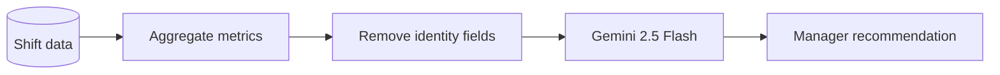

<div align="center">

# 🍽️ SmartServe OS

### From scan to serve—one live operating system for the entire restaurant.

SmartServe OS connects the diner, kitchen, floor team, and manager through a single real-time order journey. It combines secure table QR ordering, live dish availability, kitchen dispatch, floor coordination, operational analytics, and Gemini-powered recommendations in one full-stack platform.

[](https://react.dev/)
[](https://www.typescriptlang.org/)
[](https://nodejs.org/)
[](https://firebase.google.com/)
[](https://ai.google.dev/)

[**Launch SmartServe OS**](https://smartserve-os.ai.studio/) ·
[**Explore the Source**](https://github.com/Jidnyasa-P/SmartServe-OS-Smart-Restaurant-Management-System) ·
[**Report an Issue**](https://github.com/Jidnyasa-P/SmartServe-OS-Smart-Restaurant-Management-System/issues)

</div>

---

## The idea

Restaurants often operate through disconnected touchpoints: a printed or static menu for the diner, verbal communication for the kitchen, manual updates for floor staff, and delayed reports for management. One order may be copied or communicated several times before it reaches the table.

SmartServe OS replaces that fragmented workflow with one persistent operational thread:

```text
Table QR → Live Menu → Verified Order → Kitchen KDS → Floor Dispatch → Manager Insight
```

The result is not simply another digital menu or POS screen. It is a coordinated restaurant experience in which every role sees the information it needs at the moment it matters.

## 🎯 Detailed User Story Breakdown

### 🥉 Bronze Level — User Experience (User Story 1)
- **Interactive 6-Chapter Story Mode**: Visual step-by-step narrative (*Scan → Select → Kitchen Pass → Floor Route → Manager Analytics → Unified Payoff*) demonstrating how technology eliminates restaurant bottlenecks.
- **Dual-Perspective Navigation**: Seamless toggle between Customer QR Menu and Professional Management Dashboards.
- **Responsive Layout**: Designed desktop-first with full mobile touch-target support (≥44px touch areas).

### 🥈 Silver Level — Authentication & Digital Operations (User Stories 2 & 3)
- **Multi-Method Auth**: Email & Password with error fallback + **Google OAuth Sign-In** via popup integration.
- **Role-Based Access Control (RBAC)**: Strict role separation across `customer`, `staff`, `kitchen`, `manager`, and `admin`.
- **Digital Menu & Live 86 Toggles**: Instant 86ing of sold-out menu items reflected in real-time across customer screens.
- **Smart Reservations & Floor Map**: Table seating layout with status indicators (`available`, `occupied`, `reserved`, `needs_cleaning`).
- **Queue & Order Management**: Real-time order placement and kitchen workflow tracking.
- **Billing & Receipts**: Digital receipt view with itemized tax, tip calculation, and payment confirmation (`cash`, `card`, `qr_pay`).
- **Customer Notifications**: Real-time toast alerts for order status updates (`pending` → `cooking` → `ready` → `served`).

### 🥇 Gold Level — Restaurant Management (User Story 4)
- **Executive Operations Dashboard**: Centralized management interface for daily operations.
- **Orders Kanban**: Multi-column KDS view for Kitchen staff with prep latency timers and overdue alert badges.
- **Cryptographic Table QR Manager**: Generate, display, and regenerate 256-bit cryptographically random table QR tokens.
- **Inventory Tracking**: Stock level monitoring for raw ingredients with reorder alerts (`ok`, `low`, `out_of_stock`).
- **Staff Management & Audit Stream**: Staff assignment log, shift coordination, and real-time security audit trails.
- **Analytics & Revenue Metrics**: Live shift revenue calculation, average ticket times, table turnover rate, and top-selling dishes.

### 💎 Platinum Level — Intelligent Operations (User Story 5)
- **Server-Side Gemini AI Advisory**: Powered by Google Gemini 2.5 Flash (`@google/genai`).
- **Personalized Recommendations**: Smart AI dish pairing suggestions based on customer selections and dietary tags (`vegan`, `gf`, `spicy`).
- **Inventory Prediction & Demand Forecasting**: Predictive stock burn rate analysis based on active shift orders.
- **Operational Q&A Assistant**: Interactive AI assistant for shift managers to query yield optimization, waste reduction, and prep allocation.
- **Zero-PII Data Sanitization**: Customer names, emails, user IDs, and table tokens are stripped before building prompt context.

---

## Why SmartServe OS stands out

### One order, one shared operational story

The platform’s core differentiator is its **“From Scan to Serve”** experience. A table order remains visible as it moves through six connected stages instead of disappearing into separate tools.

| Chapter | Operational moment | What SmartServe OS contributes |
|---:|---|---|
| 01 | **The Scan** | Binds a diner session to a physical table through a secure QR token |
| 02 | **The Choice** | Shows a responsive menu with live stock and 86 availability |
| 03 | **The Pass** | Sends a verified ticket into the kitchen preparation workflow |
| 04 | **The Floor** | Surfaces ready orders and service requests to floor staff |
| 05 | **The Signal** | Converts shift activity into useful operational metrics |
| 06 | **The Payoff** | Gives managers privacy-conscious Gemini recommendations |

## Product experience

### Customer QR portal

- Browser-based ordering with no application installation
- Category browsing, dietary tags, preparation times, and item notes
- Live unavailable-item protection
- Table-aware cart and order creation
- Waiter assistance request
- Itemized order summary

### Kitchen Display System

- Active ticket queue with table and item details
- `pending → cooking → ready` preparation workflow
- Preparation-time visibility
- Per-item notes and station context
- Live 86 controls for sold-out dishes
- Ready-order handoff to the floor team

### Floor operations

- Visual restaurant table map
- Available, occupied, reserved, and cleaning states
- Waiter-call alerts
- Ready-to-serve order visibility
- Order delivery and table-turnover actions
- Cash, card, and QR-payment recording in the operational interface

### Manager workspace

- Menu and category management
- Table and QR-token administration
- Inventory levels and reorder indicators
- Sales, order, preparation, and table metrics
- Security and operational audit stream
- Gemini-powered restaurant operations assistant

### Platform essentials

- Email/password authentication
- Google OAuth
- Customer, staff, kitchen, manager, and administrator roles
- About, contact, privacy, and terms views
- Responsive interface and animated operational storytelling

---

## Capability matrix

| Capability | Customer | Floor staff | Kitchen | Manager | Admin |
|---|:---:|:---:|:---:|:---:|:---:|
| Browse live menu | ✓ | ✓ | ✓ | ✓ | ✓ |
| Create a table order | ✓ | — | — | — | — |
| Call a waiter | ✓ | Receive | — | Monitor | Monitor |
| View operational orders | — | ✓ | ✓ | ✓ | ✓ |
| Update kitchen status | — | Limited | ✓ | ✓ | ✓ |
| Toggle dish availability | — | — | ✓ | ✓ | ✓ |
| Manage menu and tables | — | — | — | ✓ | ✓ |
| View inventory and analytics | — | — | — | ✓ | ✓ |
| Request Gemini recommendations | — | — | — | ✓ | ✓ |
| Assign platform roles | — | — | — | — | ✓ |

> Permissions are enforced by the Express API and Firebase Admin SDK. Firestore client rules use a default-deny posture for protected writes.

---

## 📐 System Architecture & Data Flow

```
[ Customer QR Code / Mobile Browser ]          [ Staff / Kitchen / Manager Dashboard ]
                 │                                                │
                 │ Bearer Firebase ID Token                       │ Bearer ID Token
                 ▼                                                ▼
  ┌──────────────────────────────────────────────────────────────────────────────────┐
  │                           EXPRESS 5 API GATEWAY (Port 3000)                      │
  ├──────────────────────────────────────────────────────────────────────────────────┤
  │ 🔒 Helmet HTTP Security Headers        🛡️ Express-Rate-Limit (100req/min)         │
  │ 📋 Zod Schema Validation               🔑 Firebase Admin SDK Bearer Auth Token     │
  │ 🔑 Crypto SHA-256 Table Token Match    💰 Server-Side Database Price Recalculation│
  └───────────────────────────────┬──────────────────────────────────────────────────┘
                                  │
          ┌───────────────────────┴───────────────────────┐
          ▼                                               ▼
┌───────────────────────────────┐               ┌──────────────────────────────────┐
│   FIRESTORE CLOUD DATABASE    │               │  GOOGLE GEMINI 2.5 FLASH AI SDK  │
├───────────────────────────────┤               ├──────────────────────────────────┤
│ • /users (RBAC Profiles)      │               │ • /api/ai/recommendations        │
│ • /tables (Crypto QR Hashes)  │               │ • PII Sanitized Context Pipeline │
│ • /menuItems (Prices & Stock) │               │ • Inventory & Yield Prediction   │
│ • /orders (Transactional Lock)│               │ • Operational Q&A Assistant      │
│ • /inventory (Raw Ingredients)│               └──────────────────────────────────┘
│ • /auditLogs (Security Stream)│
└───────────────────────────────┘
```

---

### Request lifecycle

1. Firebase Authentication establishes the user identity.
2. Protected requests send a Firebase ID token as a Bearer token.
3. The Express server verifies the token and loads the authoritative role.
4. Zod validates every mutation before business logic runs.
5. Order creation verifies the table token and reads canonical menu prices.
6. Firestore transactions update the order and stock together.
7. Operational data is aggregated and stripped of identity fields before AI use.

---

## Security model

SmartServe OS assumes that browser state can be modified and therefore keeps sensitive decisions on the server.

| Control | Protection |
|---|---|
| **Server-side price authority** | Ignores client-supplied prices and calculates totals from Firestore menu records |
| **Cryptographic table tokens** | Generates 256-bit tokens and stores SHA-256 hashes instead of raw token values |
| **Firebase token verification** | Validates Bearer ID tokens through the Firebase Admin SDK |
| **Role-based authorization** | Restricts menu, kitchen, inventory, AI, and administration operations by role |
| **Default-deny Firestore rules** | Blocks direct client writes to sensitive operational collections |
| **Transactional ordering** | Checks availability and updates stock inside a Firestore transaction |
| **Schema validation** | Uses Zod limits and enums for incoming request payloads |
| **Rate limiting** | Applies global limits plus stricter limits to order and AI endpoints |
| **Security headers** | Uses Helmet to set defensive HTTP headers |
| **Payload limits** | Rejects JSON bodies larger than 100 KB |
| **PII minimization** | Excludes customer identity, email, user IDs, and QR tokens from Gemini context |
| **Audit events** | Records important menu, role, order, and security actions |

### Secret-handling rules

- Never commit `.env`, service-account JSON files, access tokens, or private keys.
- Keep `GEMINI_API_KEY` and `ADMIN_SECRET_KEY` server-side.
- Treat Firebase web configuration as public identifiers, but restrict the API key to the required APIs and authorized origins.
- Rotate any secret immediately if it is posted in an issue, commit, screenshot, or chat.
- Use separate Firebase projects for development and production.

For additional hardening, enable Firebase App Check, enforce a production Content Security Policy, configure a trusted proxy correctly, and move administrative role changes behind audited administrator authentication.

---

## Technology stack

| Layer | Technology | Purpose |
|---|---|---|
| Frontend | React 19 + TypeScript | Role-aware user interfaces |
| Build system | Vite 6 | Development server and optimized frontend build |
| Styling | Tailwind CSS 4 | Responsive design system |
| Motion | Motion + Anime.js | Story transitions and micro-interactions |
| Icons | Lucide React | Accessible interface iconography |
| Backend | Node.js + Express 4 | REST API and application server |
| Validation | Zod 4 | Runtime request validation |
| Security | Helmet + Express Rate Limit | Headers and abuse protection |
| Authentication | Firebase Authentication | Email/password and Google OAuth |
| Database | Cloud Firestore | Users, menu, tables, orders, inventory, and audits |
| Server identity | Firebase Admin SDK | Token verification and privileged database operations |
| AI | Google GenAI SDK | Gemini operational recommendations |
| Testing | Vitest + Supertest | API authorization and transaction regression tests |
| Production bundle | esbuild | Node server bundle |

---

## Repository structure

```text
SmartServe-OS/
├── scripts/
│   ├── assign-role.ts          # Controlled role assignment utility
│   └── seed.ts                 # Initial Firestore data
├── src/
│   ├── components/
│   │   ├── auth/               # Authentication experience
│   │   ├── story/              # Six-chapter operational journey
│   │   └── views/              # Customer, kitchen, floor and manager modules
│   ├── context/
│   │   └── StoreContext.tsx    # Client application state and actions
│   ├── lib/
│   │   ├── firebase.ts         # Firebase client initialization
│   │   └── schemas.ts          # Shared validation schemas
│   ├── App.tsx                 # Navigation and module composition
│   ├── mockData.ts             # Showcase-mode seed data
│   └── types.ts                # Domain model
├── tests/
│   └── api.test.ts             # Security-focused API tests
├── firebase-blueprint.json     # Firestore entity blueprint
├── firestore.rules             # Client database security rules
├── server.ts                   # Express API, Admin SDK and Gemini integration
├── vite.config.ts              # Vite and Tailwind configuration
└── package.json                # Scripts and dependencies
```

---

## Getting started

### Prerequisites

- [Node.js 22 LTS](https://nodejs.org/)
- npm 10 or newer
- A standard [Firebase project](https://console.firebase.google.com/)
- A [Gemini API key](https://aistudio.google.com/apikey)
- Google Cloud CLI for local Application Default Credentials, or a securely stored Firebase service-account key

### 1. Clone the repository

```bash
git clone https://github.com/Jidnyasa-P/SmartServe-OS-Smart-Restaurant-Management-System.git
cd SmartServe-OS-Smart-Restaurant-Management-System
npm install
```

### 2. Create the environment file

Copy `.env.example` to `.env`.

**PowerShell**

```powershell
Copy-Item .env.example .env
```

**macOS/Linux**

```bash
cp .env.example .env
```

Then configure:

```dotenv
# Server-only secrets
GEMINI_API_KEY="replace-with-a-new-server-key"
ADMIN_SECRET_KEY="replace-with-a-long-random-secret"

# Firebase web application configuration
VITE_FIREBASE_API_KEY="your-firebase-web-api-key"
VITE_FIREBASE_AUTH_DOMAIN="your-project.firebaseapp.com"
VITE_FIREBASE_PROJECT_ID="your-project-id"
VITE_FIREBASE_STORAGE_BUCKET="your-project.firebasestorage.app"
VITE_FIREBASE_MESSAGING_SENDER_ID="your-sender-id"
VITE_FIREBASE_APP_ID="your-app-id"

# Runtime
VITE_DEMO_MODE="false"
NODE_ENV="development"
PORT="3000"
```

> Do not copy credentials from the public repository or another Firebase project. Create a Firebase project owned by your account.

### 3. Configure Firebase

In Firebase Console:

1. Create a Cloud Firestore database using the `(default)` database ID.
2. Enable **Email/Password** under Authentication → Sign-in method.
3. Enable **Google** authentication and select a support email.
4. Register a Web app and copy its configuration into `.env`.
5. Add every production domain to Authentication → Authorized domains.

Connect the Firebase CLI:

```bash
npx firebase-tools login
npx firebase-tools projects:list
npx firebase-tools use --add
npx firebase-tools deploy --only firestore
```

### 4. Authenticate the local server

Firebase CLI login is not the same as server-side Application Default Credentials.

Recommended for local development:

```bash
gcloud auth application-default login
gcloud auth application-default set-quota-project YOUR_FIREBASE_PROJECT_ID
```

Alternatively, securely download a service-account key and set its path for the current terminal session.

**PowerShell**

```powershell
$env:GOOGLE_APPLICATION_CREDENTIALS="C:\secure\smartserve-service-account.json"
```

**macOS/Linux**

```bash
export GOOGLE_APPLICATION_CREDENTIALS="/secure/smartserve-service-account.json"
```

Never place that JSON file inside the repository.

### 5. Seed Firestore

```bash
npx tsx scripts/seed.ts
```

### 6. Start the application

```bash
npm run dev
```

Open [http://localhost:3000](http://localhost:3000).

---

## Authentication and role setup

Newly registered users should begin with the `customer` role. Operational roles must be assigned from a trusted server environment.

```bash
npx tsx scripts/assign-role.ts manager@example.com manager
npx tsx scripts/assign-role.ts chef@example.com kitchen
npx tsx scripts/assign-role.ts server@example.com staff
```

Supported roles:

```text
customer | staff | kitchen | manager | admin
```

Use a unique, high-entropy `ADMIN_SECRET_KEY`. Do not expose role assignment in public client code.

---

## REST API

### Public and customer operations

| Method | Endpoint | Purpose |
|---|---|---|
| `GET` | `/api/health` | Service health |
| `GET` | `/api/menu` | Retrieve menu items |
| `GET` | `/api/categories` | Retrieve menu categories |
| `GET` | `/api/tables` | Retrieve table information |
| `POST` | `/api/orders` | Place a QR-verified order |
| `POST` | `/api/tables/:number/waiter-call` | Request floor assistance |

### Authenticated operations

| Method | Endpoint | Required role |
|---|---|---|
| `GET` | `/api/auth/profile` | Authenticated user |
| `GET` | `/api/orders` | Staff, kitchen, manager, admin |
| `PATCH` | `/api/orders/:id/status` | Staff, kitchen, manager, admin |
| `POST` | `/api/menu` | Manager, admin |
| `PUT` | `/api/menu/:id` | Manager, admin |
| `DELETE` | `/api/menu/:id` | Manager, admin |
| `PATCH` | `/api/menu/:id/86` | Kitchen, manager, admin |
| `POST` | `/api/tables/:id/regenerate-qr` | Manager, admin |
| `GET` | `/api/inventory` | Manager, admin |
| `PUT` | `/api/inventory/:id` | Manager, admin |
| `POST` | `/api/ai/recommendations` | Manager, admin |
| `POST` | `/api/admin/assign-role` | Protected administrator operation |

Protected requests use:

```http
Authorization: Bearer <FIREBASE_ID_TOKEN>
Content-Type: application/json
```

---

## 🔑 Demo Credentials & Role Testing

To test different operational roles in the app:

| Role | Email | Password | Access Rights |
| :--- | :--- | :--- | :--- |
| **Manager** | `manager@smartserve.os` | `manager123` | Full Management Dashboard, Analytics, AI, Menu & Inventory CRUD |
| **Kitchen** | `kitchen@smartserve.os` | `kitchen123` | Kitchen Display System (KDS), Order Status, 86 Dish Toggles |
| **Staff** | `staff@smartserve.os` | `staff123` | Floor Map, Waiter Call Dismissal, Table Status Updates |
| **Customer**| `customer@smartserve.os`| `customer123`| Digital QR Menu, Cart, Order Placement, Waiter Call |

*Note: You can also click **"Continue with Google OAuth"** or use Instant Demo Session Mode on the login screen.*

---

## AI with privacy by design

The Gemini integration is deliberately server-side.



The AI context is designed around operational signals such as:

- Menu-item sales counts
- Current stock and reorder levels
- Preparation-time patterns
- Active order volume
- Shift-level performance

Names, emails, user IDs, and raw QR tokens should never be included in the model prompt. AI output is advisory and must not autonomously change prices, inventory, staffing, or orders.

---

## Available commands

| Command | Purpose |
|---|---|
| `npm run dev` | Start Express and Vite in development mode |
| `npm run lint` | Run TypeScript static checking |
| `npm run test` | Run the Vitest API test suite |
| `npm run build` | Build the frontend and bundle the Node server |
| `npm run start` | Start the production server bundle |
| `npm run clean` | Remove generated build artifacts |

### Current verification

The latest audited `main` branch completes:

```text
TypeScript check: passed
API tests:        8 passed
Production build: passed
```

The current production build emits a large JavaScript-chunk warning. Route-level lazy loading and manual vendor chunks are recommended before high-traffic deployment.

---

## Test coverage

The API regression suite currently verifies:

1. Unauthenticated management requests return `401`.
2. Customers cannot create menu items.
3. Managers can create menu items.
4. Forged client prices are ignored.
5. Invalid table QR tokens are rejected.
6. Unavailable dishes cannot be ordered.
7. Excessive item quantities fail validation.
8. Unauthorized role escalation is rejected.

Run all checks before opening a pull request:

```bash
npm run lint
npm run test
npm run build
```

---

## Implementation modes

SmartServe OS contains two complementary execution paths:

- **Operational showcase mode** uses seeded client data and browser persistence so the complete restaurant journey can be explored immediately.
- **Connected mode** uses Firebase Authentication, the Express API, Firestore transactions, protected role checks, and server-side Gemini access.

For production deployments, set `VITE_DEMO_MODE="false"`, configure real Firebase credentials, remove unrestricted guest access, and verify that every mutation calls its corresponding protected API endpoint.

---

## Production-readiness checklist

Before using SmartServe OS with a real restaurant:

- [ ] Use a dedicated production Firebase project
- [ ] Disable unrestricted showcase access
- [ ] Remove sample users, orders, and analytics
- [ ] Replace all sample currency and tax assumptions
- [ ] Enable Firebase App Check
- [ ] Enable and test email verification
- [ ] Configure a strict Content Security Policy
- [ ] Restrict Firebase and Gemini credentials
- [ ] Store secrets in the hosting provider’s secret manager
- [ ] Add server-side payment-provider verification
- [ ] Add idempotency keys to payment and order mutations
- [ ] Add multi-tenant restaurant isolation to every query
- [ ] Add structured monitoring and alerting
- [ ] Add backups, retention rules, and restore testing
- [ ] Complete accessibility, mobile, load, and security testing
- [ ] Add privacy and retention language reviewed for the deployment region

---

## Roadmap

- [ ] Real-time Firestore listeners for all operational modules
- [ ] Reservation and waitlist workflows
- [ ] Payment-gateway integration and verified digital receipts
- [ ] Multi-branch tenant isolation
- [ ] Supplier purchase orders and automated reorder proposals
- [ ] Demand forecasting using historical shift data
- [ ] Multilingual customer menus
- [ ] Printer and POS integrations
- [ ] Offline-resilient kitchen ticket queue
- [ ] Web push notifications for kitchen and floor teams
- [ ] Accessibility audit against WCAG 2.2 AA
- [ ] Route-based code splitting and performance budgets

---

## Contributing

Contributions should be focused, secure, and accompanied by verification.

1. Fork the repository.
2. Create a branch:

   ```bash
   git checkout -b feat/short-description
   ```

3. Make the change and add tests where applicable.
4. Run:

   ```bash
   npm run lint
   npm run test
   npm run build
   ```

5. Commit using a clear conventional message:

   ```bash
   git commit -m "feat: add kitchen notification preference"
   ```

6. Push the branch and open a pull request.

Security vulnerabilities should not be disclosed in a public issue. Contact the maintainer privately with reproduction steps and impact.

---

## License

No open-source license file is currently committed to this repository. Until a license is added, the source remains copyrighted by its owner and should not be redistributed or reused without permission.

If the project is intended for open-source use, add an [MIT License](https://opensource.org/license/mit) as a separate `LICENSE` file and update this section.

---

## Maintainer

**Jidnyasa Patil**

[GitHub](https://github.com/Jidnyasa-P) ·
[Repository](https://github.com/Jidnyasa-P/SmartServe-OS-Smart-Restaurant-Management-System)

---

<div align="center">

### A restaurant that moves as one.

**Scan. Choose. Cook. Serve. Understand.**

Built with React, Express, Firebase, Firestore, and Gemini.

</div>
